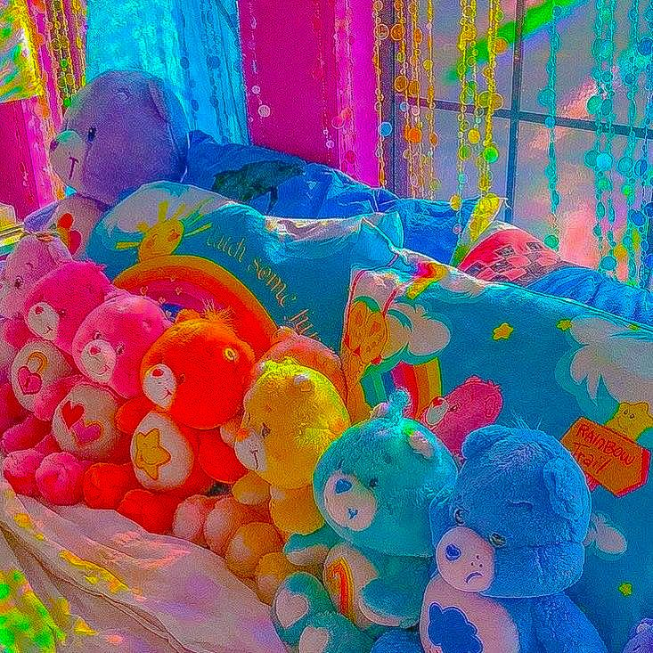

<h1 align="center">Hi 👋, I'm Amirah Heng</h1>
<h3 align="center">A passionate Data Scientist from Malaysia</h3>

- 📫 How to reach me **hengamirah@gmail.com**

<h3 align="left">Connect with me:</h3>

<h3 align="left">Languages and Tools:</h3>

      

# Sentiment_Analysis
 Trained with 60,000 IMDB dataset to categorize positive and negative reviews

# Step-by-step guide

1. To launch the app, clean the project and execute it
2. Key your information

*Hello World*

**Hello World Bolded**

That is so funny! :joy:

# This is to insert code in readme
'from tensorflow.keras.layers import Dense'

'print("hello")'

'print("what to eat")'

## To include url link

## To include images

